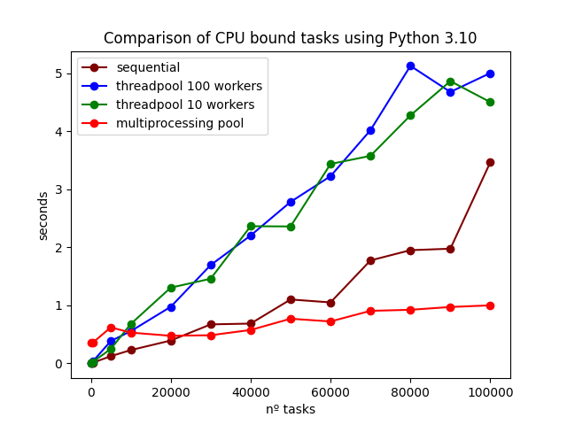
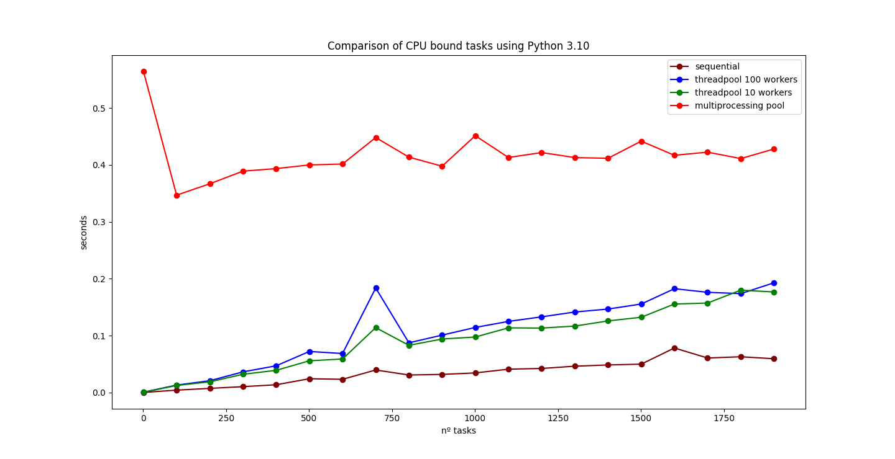

# Python - Performance Benchmark


The focus is on measuring the 90th percentile (p90) performance for each approach while executing with varying data input sizes.

# CPU bound tasks
This project aims to benchmark the performance of different Python concurrency approaches for four types of workloads:
sequential, thread pool with 100 workers, thread pool with 10 workers, and using multiprocessing pool.

## Motivation
Understanding the performance characteristics of different concurrency strategies is crucial for developing efficient
and scalable Python applications. This benchmark project provides insights into how various multiprocessing techniques
perform under different workloads and input sizes. Also, it's important to prove that threads for CPU bounded tasks that
do not work well in Python because of GIL.

## Examples
1. **Sequential**: This approach represents the baseline performance of executing tasks sequentially.
2. **Thread Pool (100 workers)**: This approach utilizes a thread pool with 100 workers to parallelize tasks.
3. **Thread Pool (10 workers)**: This approach utilizes a thread pool with 10 workers to parallelize tasks.
4. **Multiprocessing Pool**: This approach utilizes the `multiprocessing` module to distribute tasks among multiple
   processes.

## Results

 <!-- Replace with the actual path to your benchmark image -->
 <!-- Replace with the actual path to your benchmark image -->

# Flat lists

## Motivation
This repository provides different methods for working with lists in Python, aiming to help developers understand and compare various approaches to handle list operations efficiently. By exploring different techniques like using the `sum` function, `extend` method, `+` operator, and list comprehensions, developers can optimize their code based on specific use cases and improve the performance of their programs.

## Examples

### Using `sum`
The `sum` function in Python allows you to calculate the sum of elements in a list efficiently. By utilizing `sum`, you can simplify your code and enhance readability when dealing with numerical lists.

```python
numbers = [1, 2, 3, 4, 5]
total = sum(numbers)
print("Sum of numbers:", total)
```

### Using extend
The extend method in Python is used to add multiple elements to a list. It is particularly useful when you want to combine the contents of multiple lists into a single list, extending the original list efficiently.

```python
list1 = [1, 2, 3]
list2 = [4, 5, 6]
list1.extend(list2)
print("Extended list:", list1)
```

### Using + Operator
The + operator in Python can be used to concatenate two lists. It creates a new list by combining the elements of the given lists. While simple and intuitive, it's essential to understand its behavior, especially in terms of performance for large lists.

```python
list1 = [1, 2, 3]
list2 = [4, 5, 6]
result = list1 + list2
print("Concatenated list:", result)
```

### Using List Comprehension
List comprehensions provide a concise way to create lists. They are efficient and readable, allowing developers to create new lists by applying an expression to each item in an existing iterable (e.g., list, tuple, range) and optionally applying a filter condition.

```python
numbers = [1, 2, 3, 4, 5]
squares = [x**2 for x in numbers]
print("Squared numbers:", squares)
```

## Results

 <!-- Replace with the actual path to your benchmark image -->

## Usage

1. Ensure you have **Python 3.10** installed. You can download it from
   the [official Python website](https://www.python.org/downloads/release).

2. Clone this repository:
   ```sh
   git clone git@github.com:luisgsilva950/research-python-concurrency-benchmark.git
   cd research-python-concurrency-benchmark
   virtualenv venv 
   source venv/bin/activate
   pip install -r requirements.txt
   python3 cpu_bound_tasks_benchmark.py
   python3 concat_lists_benchmark.py
   python3 dataclass_vs_namedtuple_benchmark.py
   ```
