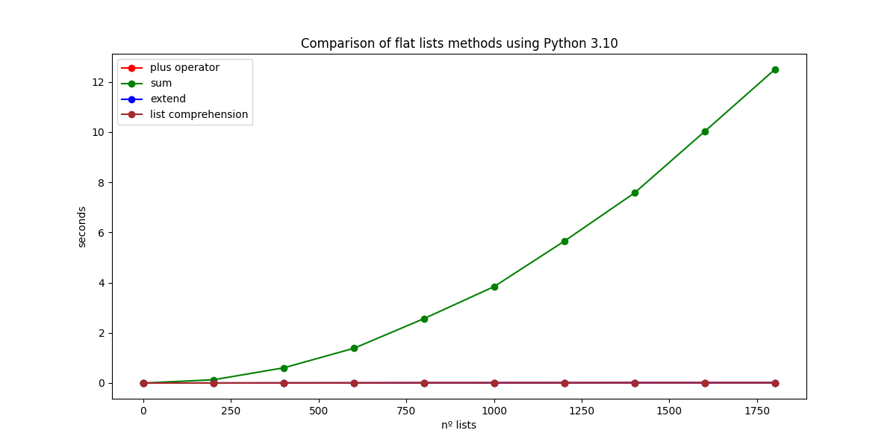
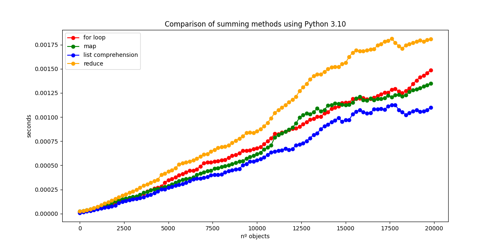

# Python - Performance Benchmark


The focus is on measuring the 90th percentile (p90) performance for each approach while executing with varying data input sizes.

# CPU bound tasks
This project aims to benchmark the performance of different Python concurrency approaches for four types of workloads:
sequential, thread pool with 100 workers, thread pool with 10 workers, and using multiprocessing pool.

## Motivation
Understanding the performance characteristics of different concurrency strategies is crucial for developing efficient
and scalable Python applications. This benchmark project provides insights into how various multiprocessing techniques
perform under different workloads and input sizes. Also, it's important to prove that threads for CPU bounded tasks do not work well in Python because of GIL.

## Examples
1. **Sequential**: This approach represents the baseline performance of executing tasks sequentially.
2. **Thread Pool (100 workers)**: This approach utilizes a thread pool with 100 workers to concurrent tasks.
3. **Thread Pool (10 workers)**: This approach utilizes a thread pool with 10 workers to concurrent tasks.
4. **Multiprocessing Pool**: This approach utilizes the `multiprocessing` module to distribute tasks among multiple
   processes.

### Results

.png)
.png)

# Flat lists

## Motivation
It explores different techniques like using the `sum` function, `extend` method, `+` operator, and list comprehensions for flat lists, e.g. transform `[[1, 2, 3], [4, 5, 6, 7]]` in `[1, 2, 3, 4, 5, 6, 7]`.

## Examples

### Using `sum`
The `sum` function in Python allows you to calculate the sum of elements in a list efficiently. By utilizing `sum`, you can simplify your code and enhance readability when dealing with numerical lists.

```python
numbers = [[1, 2], [3, 4, 5]]
total = sum(numbers, [])
print("Flat numbers:", total)
```

### Using extend
The extend method in Python is used to add multiple elements to a list. It is particularly useful when you want to combine the contents of multiple lists into a single list, extending the original list efficiently.

```python
list1 = [1, 2, 3]
list2 = [4, 5, 6]
list1.extend(list2)
print("Extended list:", list1)
```

### Using + Operator
The + operator in Python can be used to concatenate two lists. It creates a new list by combining the elements of the given lists. While simple and intuitive, it's essential to understand its behavior, especially in terms of performance for large lists.

```python
list1 = [1, 2, 3]
list2 = [4, 5, 6]
result = list1 + list2
print("Concatenated list:", result)
```

### Using List Comprehension
List comprehensions provide a concise way to create lists. They are efficient and readable, allowing developers to create new lists by applying an expression to each item in an existing iterable (e.g., list, tuple, range) and optionally applying a filter condition.

```python
nested_list = [[1, 2, 3], [4, 5, 6], [7, 8, 9]]
flat_list = [element for sublist in nested_list for element in sublist]
```

### Results




# Logging DEBUG Alternatives

This test explores three different approaches for processing log messages in Python, aiming to understand their efficiency when the log level is disabled. The three methods compared are:

1. **F-String**
2. **String Format**
3. **Logging Library Parameters**
4. **Logging checking log level**
5. **Logging formatting with %**

The main objective is to determine the most efficient approach for handling log messages when the log level is disabled. In situations where the log level is set to a higher threshold (e.g., INFO, WARNING, ERROR), unnecessary processing of log entries at a lower level (e.g., DEBUG) can be a performance overhead. By identifying the most efficient method, developers can make informed decisions to optimize their logging practices.

## Comparison

### 1. F-String

Using f-strings for log messages provides a concise and readable syntax. However, the question arises: How does the processing of f-strings impact performance when the log level is disabled?

```python
logger.debug(f"Using f-string: {text}")
```

### 2. String Format

String formatting is a classic approach that offers flexibility. This method involves using the `format` method to insert values into a string. How does this compare in terms of performance when the log level is disabled?

```python
logger.debug("Using string format: {}".format(text))
```

### 3. Logging Library Parameters

The logging library in Python provides a robust mechanism for handling log messages. By passing parameters to the logging functions, we can control when and how log messages are processed. How does this approach fare in terms of efficiency?

```python
logger.debug("Using logging parameters: %s", text)
```

### 4. Logging checking log level

The logging library in Python provides a robust mechanism for handling log messages. We are able to check if the log level is enabled, so we can process the input just inside this condition. How does this approach fare in terms of efficiency?

```python
if logger.isEnabledFor(logging.DEBUG):
    logger.debug("Using logging parameters checking log level: %s", text)
```

### 5. Logging formatting with %

String formatting with % is a classic approach that offers flexibility. This method involves using the `%` operator to format strings. How does this compare in terms of performance when the log level is disabled?

```python
logger.debug("Using percent format: %s" % (text))
```

### Results
.png)
.png)

# Summing Methods for Custom Objects
## Motivation
It explores different methods for summing attributes of custom objects in Python, focusing on the summation of the x attribute of objects of the `MyObject` class. By comparing methods like using a for loop, map, list comprehensions, and functools.reduce, developers can choose the most suitable approach based on their specific use cases, optimizing code and improving program performance.

## Examples

### 1. Using a for-loop

The for loop is a traditional method for summing attributes of objects. In this implementation, a for loop iterates over the objects, accumulating the sum.

```python
total = 0
for obj in objects:
    total += obj.x
```

### 2. Using map

The map function provides a concise way to apply a function to each element in an iterable. This example uses map to extract the x attribute from each object and then calculates the sum.

```python
total = sum(map(lambda obj: obj.x, objects))
```

### 3. Using List Comprehension

List comprehensions offer a concise and readable syntax for creating lists. This example utilizes list comprehension to sum the x attribute of objects efficiently.

```python
total = sum(obj.x for obj in objects)
```

### 4. Using functools reduce

The functools.reduce function cumulatively applies a function to the items of an iterable. In this case, it's used to sum the x attribute of the objects.

```python
import functools
total = functools.reduce(lambda acc, obj: acc + obj.x, objects, 0)
```

### Results


## Usage

1. Ensure you have **Python 3.10** installed. You can download it from
   the [official Python website](https://www.python.org/downloads/release).

2. Clone this repository:
   ```sh
   git clone git@github.com:luisgsilva950/research-python-concurrency-benchmark.git
   cd research-python-concurrency-benchmark
   virtualenv venv 
   source venv/bin/activate
   pip install -r requirements.txt
   python3 cpu_bound_tasks_benchmark.py
   python3 concat_lists_benchmark.py
   python3 dataclass_vs_namedtuple_benchmark.py
   python3 logging_ways_benchmark.py
   python3 summing_list_benchmark.py
   ```
